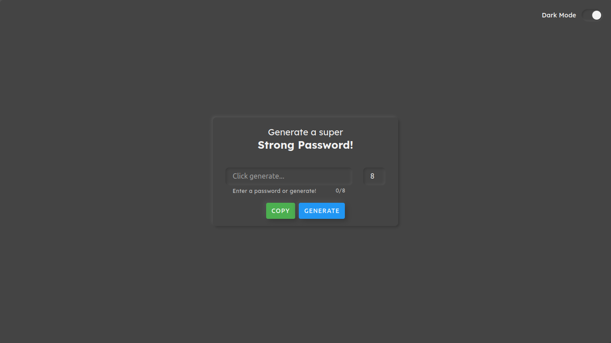
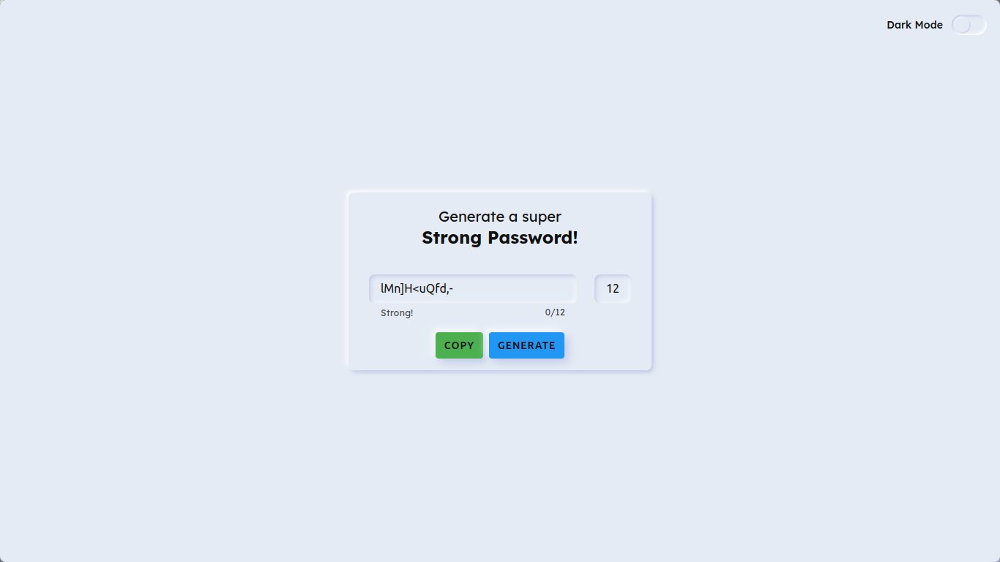
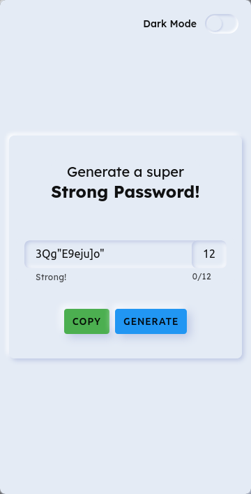
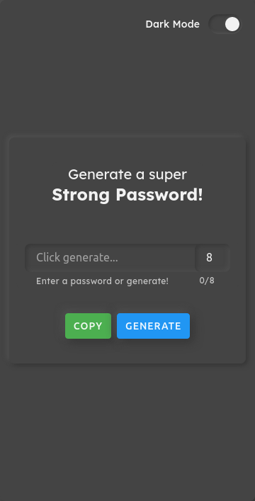

<!-- PROJECT LOGO -->
 

  

  <h3 align="center">Password Generator using React!</h3>

  

    An awesome Password generating and password strength checking PWA made with React!
     
    <a href="https://github.com/Muhammed-Rahif/Password-Generator/">Github Link</a>
    ·
    <a href="https://github.com/Muhammed-Rahif/Password-Generator/issues/">Report Bug</a>
    ·
    <a href="https://github.com/Muhammed-Rahif/Password-Generator/pulls/">Send a Pull Request</a>
  

---

## 📱️ Screenshots 

### Desktop

  
  
 

### Mobile

  
  

## ⛏️ Built Using 

- [React](https://www.themoviedb.org/) - React is a free and open-source front-end JavaScript library for building user interfaces or UI components.
- [UI-Neumorphism](https://akaspanion.github.io/ui-neumorphism/) - ui-neumorphism is a react component library designed on the "new skeuomorphism" UI/UX trend.

## ✍️ Authors 

- [@Muhammed-Rahif](https://github.com/Muhammed-Rahif) - Idea & Full work

<!-- ## 🎉 Acknowledgements 

- Hat tip to anyone whose code was used
- Inspiration
- References -->
